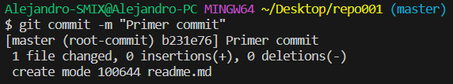

# ALEJANDRO AGUSTENCH
## ➡️​ EJERCICIO 1
  ### 🌐 Crear el directorio ***repo001*** desde el terminal de Windows ​
  > 1.  El primer paso que he hecho ha sido abrir un /cmd/, desde alli he creado el directorio ___repo001___ con un *mkdir*.
  >2. Desde dentro del directorio he hecho ***git init*** y para comprovar he hecho ***dir /a*** para comprobar que se ha creado correctamente. 

### ​💡​ He creado el ***readme.md*** desde dentro de Git Bash con los siguientes comandos: ​
  
  
### ​​💻​ Desde dentro de terminal de VSC con Git he hecho los siguientes comandos:

+ Para añadir al repositorio de standing area.

+ He hecho una snapshot (commit).

+ ***git log*** para comprobar que se haya hecho correctamente.
  
### ​​​⛔​ Intento de Git Push
Hemos hecho un ***git push*** desde terminal y nos ha dado error fatal

### ​​​​🔁​ Git remote -v ¿Porque no sale nada?
Despues de hacer el comando ***git remote -v*** y ver que no sale nada he buscado información para encontrar el porque, y he encontrado que la ***-v*** es para mostrar las URL's de los repositorios remotos, los cuales aun no tenemos.
### Crear repositorio remoto
Este paso es un paso realmente sencillo, solo hay que hacer 2 cosas:
1. Crear el repositorio remoto en GitHub
   
2. Poner los 3 comandos que te indica Github
   
